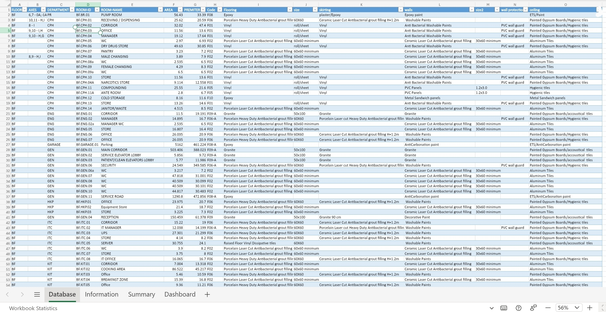
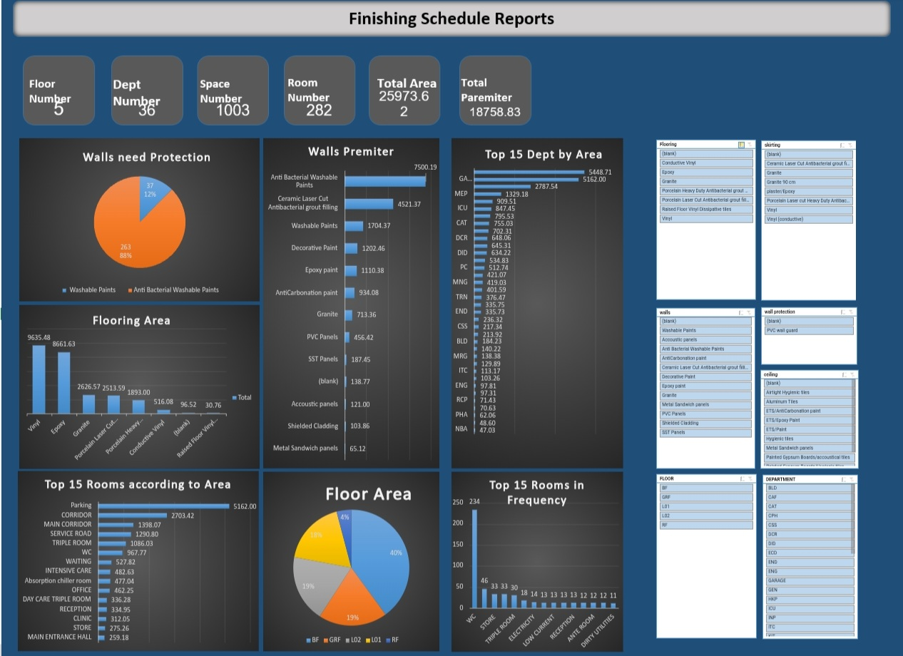
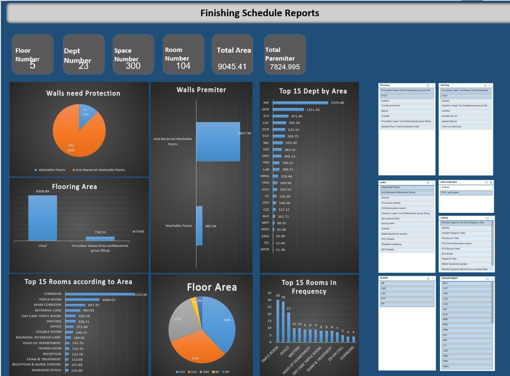

# Hospital-Building-Management-Dataset
This project focuses on analyzing and organizing hospital building data including floors, rooms, departments, Wall Protection, and area allocation.

## Overview
In this project I have worked on organizing,analyzing hospital building data, and making clear summaries of all hospital building data, which helped  engineers to prepare reports in more efficient way.

## Tools
- Excel
- Power Query
- Power Pivot

## What I Learned
Working on this project helped me understand hospital facility planning, room classification, department distribution, and space management concepts in addition to developing my data modeling skills.

## Dashboard

 

